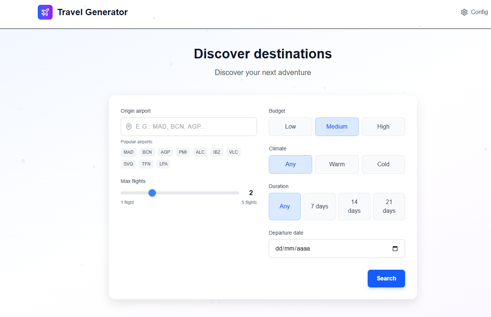

# Travel Generator ✈️

Travel Generator suggests random travel destinations with real or simulated flight prices based on your preferences. Built with Next.js, features stunning visual effects, and provides instant booking links.



## 🚀 Features

- **Random Destination Generator** - Get unique travel suggestions based on your origin and preferences
- **Multi-source Flight Prices** - Real APIs, Skyscanner scraping, or simulated data
- **Stunning Visual Effects** - GSAP animations, Three.js particles, Framer Motion interactions
- **Sound Effects** - Immersive audio feedback for interactions
- **Direct Booking Links** - Google Flights, Kayak, Momondo, Booking.com, Expedia
- **Configurable Modes** - Switch between API, scraper, mock, or hybrid modes
- **Modern UI** - Built with Next.js 15, TypeScript, and Tailwind CSS

## 🎨 Visual Effects & Animations

### **Entry Animation**
- **Flying Plane Effect** - Translucent plane flying from bottom to top on first visit
- **GSAP Timeline** - Professional animations with smooth easing
- **Particle Trails** - Animated particles following the plane
- **Wave Effects** - Expanding waves around the aircraft

### **Background Effects**
- **3D Particle System** - 100 animated particles using Three.js
- **Floating Elements** - 2D particles with CSS animations
- **Parallax Scrolling** - Dynamic background movement
- **Interactive Elements** - Hover effects and micro-interactions

### **Sound System**
- **Plane Whoosh Sound** - Realistic aircraft passing effect
- **Button Click Feedback** - Audio response for interactions
- **Success Melody** - Musical arpeggio for completed actions
- **Volume Control** - Mute/unmute toggle in top-right corner

## 🛠️ Tech Stack

### **Core Framework**
- **Framework:** Next.js 15 (App Router)
- **Language:** TypeScript
- **Styling:** Tailwind CSS

### **Animation Libraries**
- **GSAP** - Professional animations and timelines
- **Framer Motion** - React animations and gestures
- **Three.js** - 3D graphics and particle systems
- **React Intersection Observer** - Scroll-triggered animations

### **APIs & Data**
- **AviationStack** - Flight data API
- **Amadeus** - Travel search API
- **Kiwi** - Flight booking API
- **Puppeteer** - Web scraping for Skyscanner

## 📦 Installation

1. **Clone the repository**
   ```bash
   git clone https://github.com/elkoyote07/travel-generator.git
   cd travel-generator
   ```

2. **Install dependencies**
   ```bash
   npm install
   ```

3. **Set up environment variables**
   ```bash
   cp ENV_EXAMPLE.md .env.local
   ```
   Edit `.env.local` with your preferred configuration.

4. **Run the development server**
   ```bash
   npm run dev
   ```

5. **Open your browser**
   Navigate to [http://localhost:3000](http://localhost:3000)

## ⚙️ Configuration

The app supports multiple modes of operation:

- **Mock Mode** (default): Generates realistic simulated prices
- **Scraper Mode**: Uses Skyscanner web scraping
- **API Mode**: Uses free flight APIs (AviationStack, Amadeus, Kiwi)
- **Hybrid Mode**: Tries APIs first, then scraper, finally mock

See `ENV_EXAMPLE.md` for detailed configuration options.

## 🎯 Visual Effects Configuration

### **Entry Animation Settings**
- **First Visit Only**: Animation shows only on first visit (stored in localStorage)
- **Duration**: 3.5 seconds total animation time
- **Easing**: Custom cubic-bezier curves for smooth motion
- **Fallback**: CSS animations if GSAP is unavailable

### **Particle System**
- **3D Particles**: 100 particles with custom colors and movement
- **2D Particles**: 20 floating elements with CSS animations
- **Performance**: Optimized for 60fps on modern devices
- **Responsive**: Adapts to different screen sizes

### **Sound Effects**
- **Web Audio API**: Synthesized sounds for cross-platform compatibility
- **Volume Control**: Global mute/unmute functionality
- **Custom Frequencies**: Tailored audio for different interactions
- **Browser Support**: Works on all modern browsers

## 📱 Usage

1. **Experience the Entry Animation** - Watch the flying plane on your first visit
2. **Select your origin airport** (IATA code or popular options)
3. **Set your preferences:**
   - Maximum number of flights
   - Budget (Low/Medium/High)
   - Preferred climate (Any/Warm/Cold)
   - Trip duration (±7, ±14, ±21 days)
   - Departure date
4. **Generate trip** - Get 3 random destination suggestions with visual feedback
5. **Explore results** - View prices and booking links with smooth animations

## 🔧 API Setup (Optional)

For real flight prices, you can configure free APIs:

- **AviationStack:** [Get free API key](https://aviationstack.com/)
- **Amadeus:** [Get free API key](https://developers.amadeus.com/)
- **Kiwi:** [Get free API key](https://tequila.kiwi.com/)

## 🎨 Customization

### **Animation Timing**
Modify animation durations in the component files:
- `src/components/EntryAnimationGSAP.tsx` - Entry animation timing
- `src/components/ParticleBackground.tsx` - Particle movement speed
- `src/app/globals.css` - CSS animation durations

### **Visual Themes**
Customize colors and effects:
- Update Tailwind classes for color schemes
- Modify Three.js particle colors
- Adjust GSAP animation parameters

### **Sound Design**
Customize audio effects:
- `src/components/SoundEffects.tsx` - Frequency and duration settings
- Modify oscillator types and gain values
- Add new sound effects for different interactions

## 📄 License

This project is licensed under the MIT License - see the [LICENSE](LICENSE) file for details.

## 🤝 Contributing

1. Fork the repository
2. Create your feature branch (`git checkout -b feature/AmazingFeature`)
3. Commit your changes (`git commit -m 'Add some AmazingFeature'`)
4. Push to the branch (`git push origin feature/AmazingFeature`)
5. Open a Pull Request

## 📞 Support

If you have any questions or need help, please open an issue on GitHub.

---

**Happy Traveling! ✈️🌍**
